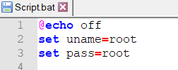
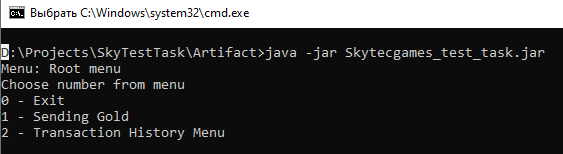
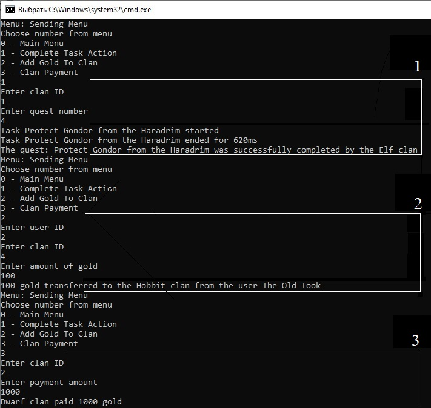
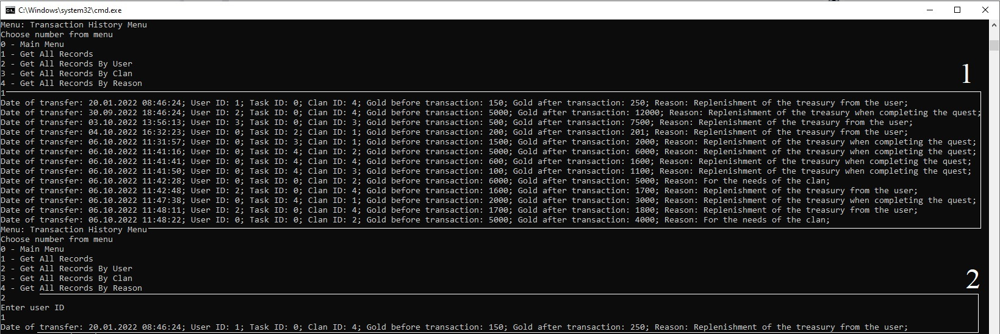

## Skytec Games Test Task

The project is a solution for Skytec Games test task: https://testtask.skytecgames.com/

## Building the application

This is a Java 8 application that uses Apache Maven to build. MySQL database version 8+ is needed for the project to work.

- Build project using Maven. Generated `.jar` file. 
    ```
    mvn install
    ```
- Confure your `uname` and `pass` in 'Script.bat':  
  
  

- Run 'Script.bat'. The `skytecgames` and `skytecgamestest` schema will be created in your DB.  
    ```
    ./Scripts/Script.bat
    ```

## Testing  the application

According to the task, the application must be multithreaded and work with simultaneous crediting / debiting of gold from hundreds of threads. Tests are implemented to check this condition.

- To test the project using Maven, run:
    ```
    mvn test
    ```

## Run Application:
Use compiled binary `Skytecgames_test_task.jar` file or download `Artifact.rar` from [releases](https://github.com/viktarkavalchuk/SkyTestTask/releases) and run `Start.bat`. 

You will see the main menu:



0. Exit the application.
1. Operations with gold (complete a quest and get gold, transfer gold from the user, payment of gold by the clan);
2. Transaction history.

Select the desired item and enter from the keyboard.

For example: 
 ```
(1) SendingMenu / 1 - Complete Task Action / Clan Id = 1 / Quest number = 4;
(2) SendingMenu / 2 - Add Gold to Clan/UserId = 2 / ClanId = 4 / Amount of gold = 100 gold;
(3) SendingMenu / 3 - Clan Payment / ClanId = 2 / Payment amount = 1000 gold;
 ```



 ```
(1) TransactionHistoryMenu / Get All Records
(2) TransactionHistoryMenu / Get All Records by User / UserId = 1
 ```



